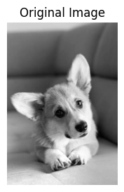
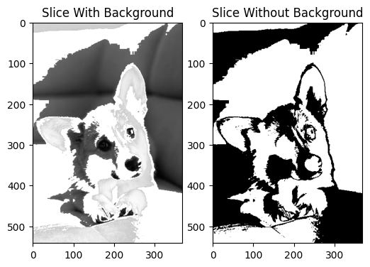

# AIM

To demonstrate **intensity level slicing** of an image by selecting and highlighting pixels within a specified range of intensity values.

# SOFTWARE USED

* **Google Colab**
* **Python**
* **OpenCV (`cv2`)**
* **NumPy**
* **Pandas**
* **Matplotlib**

# THEORY

## INTENSITY LEVEL SLICING

Intensity level slicing is an image processing technique used to **highlight a specific range of intensity values** in an image.

In this technique, a particular range of pixel intensity values is selected and highlighted, while the remaining pixels are either retained or suppressed.

For an 8-bit image, pixel intensity values generally range from **0 to 255**.

In this experiment, the selected intensity range is **100 to 200**.

## WORKING OF INTENSITY LEVEL SLICING

* The input image is loaded and processed.
* The intensity value of each pixel is examined.
* A minimum intensity value of **100** and a maximum intensity value of **200** are selected.
* Pixels whose intensity values fall within this range are identified.
* The selected pixels are highlighted.
* Two different outputs are generated:

  * **Slicing With Background**
  * **Slicing Without Background**
* The processed images are displayed for comparison.

## INTENSITY RANGE USED

The intensity range selected for this experiment is:

**100 ≤ Intensity ≤ 200**

Pixels within this range are considered the selected intensity region.

Pixels outside this range are treated as background depending on the type of slicing.

## SLICING WITH BACKGROUND

In **slicing with background**, the pixels belonging to the selected intensity range are highlighted while the background information of the original image is retained.

This method allows the selected region and the surrounding background to be observed together.

## SLICING WITHOUT BACKGROUND

In **slicing without background**, the selected intensity region is separated from the background.

The background is suppressed, making the selected intensity region easier to identify and analyze.

## EFFECT OF INTENSITY LEVEL SLICING

Intensity level slicing emphasizes specific regions of an image based on their intensity values.

* **Selected intensity range** → Highlighted
* **Pixels outside the selected range** → Treated as background
* **With background** → Background information is retained
* **Without background** → Background is suppressed

The selected intensity range can be changed depending on the region or object that needs to be highlighted.

## APPLICATIONS

Intensity level slicing is useful in:

* Image enhancement
* Medical image processing
* Image segmentation
* Feature extraction
* Object detection
* Satellite image analysis
* Industrial image processing
* Digital image processing

# CONCLUSION

The experiment demonstrates **intensity level slicing** by selecting and highlighting pixels within the intensity range of **100 to 200**. The results are observed using **slicing with background** and **slicing without background**. This technique helps in emphasizing specific regions of an image and is useful in **image enhancement, segmentation, feature extraction, and digital image processing**.
